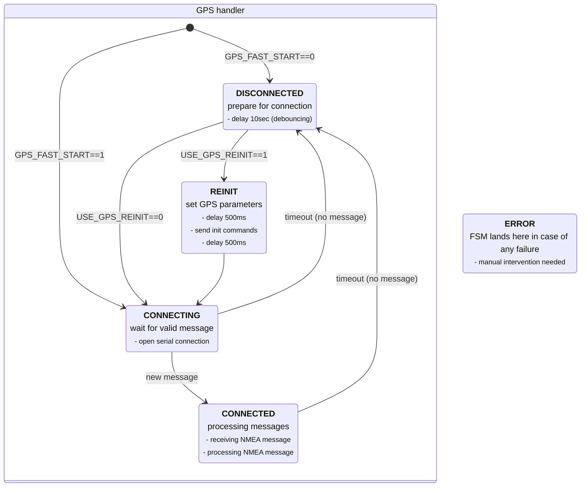

# DCF77recex-freertos


- config.h - defines of hardware connections, working parameters
- common.h - references to common resources
- blink.h/cpp - blinking "heartbeat" task
- logger.h/cpp - thread-safe logging to serial output
- screen.h/cpp - basic screen handling and refreshing
- dcfread.h/cpp - read local time from DCF77 receiver module
- sysclk.h/cpp - some time/RTC manipulation and synchronization routines
- gpsread.h/cpp - read UTC time from serial connected GPS module
- tzwatchdog.h/cpp - timezone watchdog


## GPS handler FSM

The diagram shows the GPS autoinitialization FSM. All UART or hardware failures will force the FSM into the ERROR state
(outside of the GPS handler block) where manual intervention is required.




# DCF77FreeRTOS Module

## Overview

`DCF77FreeRTOS` is an interrupt-driven, queue-based and thread-safe DCF77 time signal decoder designed for ESP32 under FreeRTOS.  
It replaces the legacy Arduino-style blocking DCF77 library while keeping full API compatibility (`begin()`, `getTime()`, etc.).

The module separates real-time signal capture from frame decoding using FreeRTOS infrastructure:
- **ISR** - triggered on each signal edge, timestamps the event and pushes it to a queue  
- **Task** - processes queue events, reconstructs the 59-bit DCF frame  
- **Event group** - signals new minute or error conditions (`DCF_EVENT_NEW_MINUTE`, `DCF_EVENT_ERROR`)

---

## Architecture

### 1. Signal Capture (ISR)
The interrupt service routine only records timestamps on each rising or falling edge  
using `millis()` and sends them to a FreeRTOS queue.  
No timing calculation or decoding is done inside the ISR.

### 2. Task - Pulse Timing & Bit Classification
The DCF task dequeues timestamps, calculates deltas, and classifies pulses:

| Pulse length | Meaning |
|--------------|----------|
| ~100 ms | Logic 0 |
| ~200 ms | Logic 1 |
| ~1800 ms | Minute marker (end of frame) |

Bits are collected into a 64-bit variable (`uint64_t recbits`) up to 59 bits.

### 3. Frame Decoding
Once a full frame (59 bits) is received, `decodeFrame_()` interprets the data according to the DCF77 specification (BCD-coded fields):

| Field | Bits | Notes |
|--------|------|-------|
| Minute | 21-27 | ones: 21-24, tens: 25-27 |
| Hour | 29-34 | ones: 29-32, tens: 33-34 |
| Day | 36-41 | ones: 36-39, tens: 40-41 |
| Day of week | 42-44 | 1-7 |
| Month | 45-49 | ones: 45-48, tens: 49 |
| Year | 50-57 | ones: 50-53, tens: 54-57 |

Decoded data is stored in a simple struct:

```cpp
struct DCFtime {
  uint8_t minute, hour, day, month, year, dow;
  bool dst;
  uint32_t tstamp;
  bool newtime;
};
```

