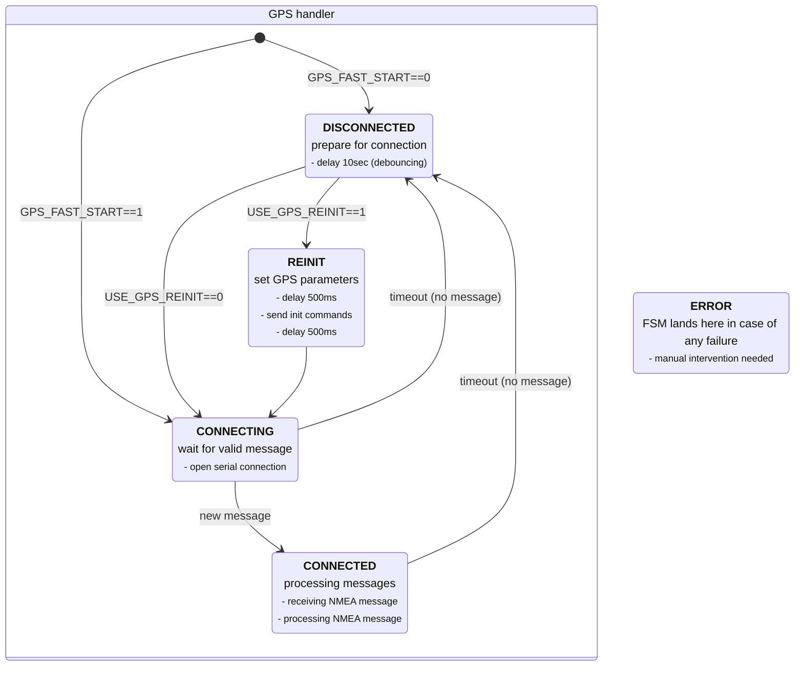

# DCF77recex-freertos

- config.h - defines of hardware connections, working parameters
- common.h - references to common resources
- blink.h/cpp - blinking "heartbeat" task
- logger.h/cpp - thread-safe logging to serial output
- screen.h/cpp - basic screen handling and refreshing
- dcfread.h/cpp - read local time from DCF77 receiver module
- sysclk.h/cpp - some time/RTC manipulation and synchronization routines
- gpsread.h/cpp - read UTC time from serial connected GPS module

## GPS handler FSM

The diagram shows the GPS autoinitialization FSM. All UART or hardware failures will force the FSM into the ERROR state
(outside of the GPS handler block) where manual intervention is required.

